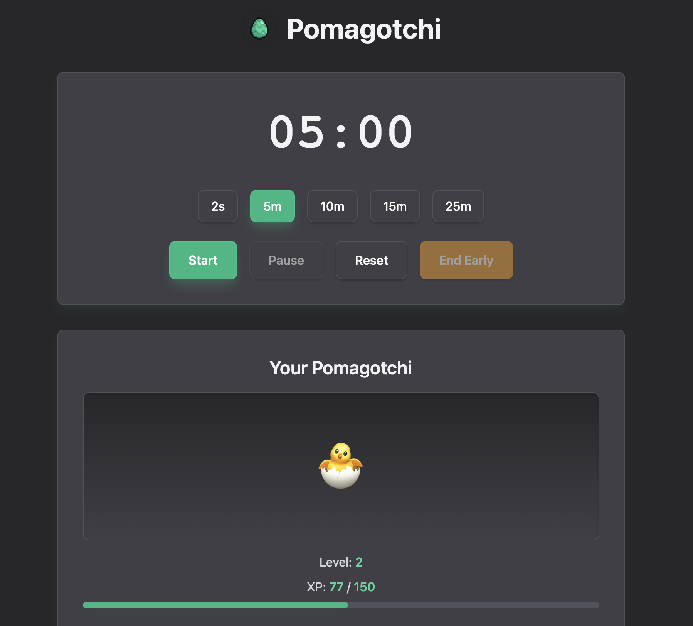

# Pomagotchi

A Pomodoro + creature raising productivity application that gamifies focus time by letting you grow and evolve a virtual creature through completed Pomodoro sessions.



## Tech Stack

- **Backend**: Rust (Tauri 2.0)
- **Frontend**: Vanilla JavaScript, HTML, CSS (Tailwind CSS)
- **State Management**: Rust with async Tokio for persistent JSON storage
- **Notifications**: Tauri Plugin Notification
- **Targets**: Desktop (macOS, Windows, Linux) & Android

## Key Features

- Pomodoro timer with customizable preset durations
- Creature evolution system with level progression and XP
- Four evolution stages: Egg → Baby → Teen → Adult
- Persistent state management across sessions
- Streak tracking and progress statistics
- Session history with total Pomodoros, XP earned, and study time
- Desktop notifications for session completion
- Local JSON-based save system

## Development

### Prerequisites

- Rust (latest stable)
- [just](https://github.com/casey/just) command runner
- Platform-specific tools for Tauri (see [Tauri Prerequisites](https://v2.tauri.app/start/prerequisites/))

### Quick Start

```bash
# List available commands
just

# Run in development mode
just dev

# Build for production
just run
```

### Android Development

```bash
# Initialize Android
just android-rebuild

# Run on Android emulator
just android

# Build and install debug APK to device
just debug
```

### iOS Development

Possible, but not yet configured.

## Project Structure

- `src/` - Frontend (HTML, CSS, JS)
- `src-tauri/src/` - Rust backend
  - `lib.rs` - Thin orchestrator: wires modules & registers Tauri commands
  - `state.rs` - Core domain data structures (`CreatureState`, `TimerState`, `GameProgress`, `GameState`) and evolution logic
  - `app_state.rs` - Persisted application state wrapper (`AppState`) + disk I/O + date helper
  - `commands/` - Grouped Tauri command modules (separation by concern)
    - `creature.rs` - Creature CRUD & XP gain endpoints
    - `progress.rs` - Pomodoro completion logic & streak tracking
    - `timer.rs` - Timer state getters/setters (debounced persistence)
    - `game.rs` - Whole-game load/save/reset endpoints
    - `mod.rs` - Re-exports for command registration
  - `main.rs` - Application entry point (binary target for Tauri)

## How It Works

The app combines Pomodoro productivity with creature care mechanics. When you complete a Pomodoro session, your creature gains experience points. As XP accumulates, the creature levels up and evolves through different life stages. The app tracks your progress, maintains streaks, and persists all data locally between sessions.
